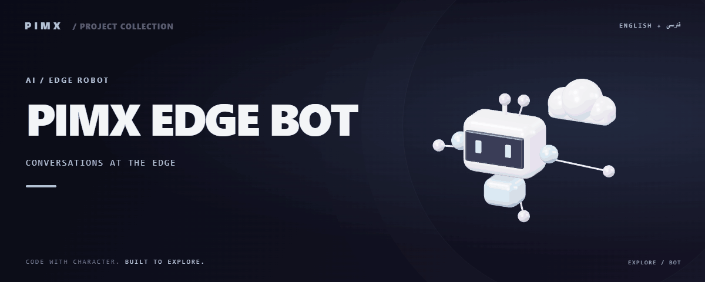

<div align="center">



**[English](README.md) · [فارسی](README.fa.md)**

</div>

# 🤖 PIMX EDGE BOT

A Telegram AI assistant implemented as a Cloudflare Worker, with provider routing, chat memory, reminders and per-user timezone helpers.

[GitHub](https://github.com/MOHAMMADREZAABEDINPOOR/BOT) · [PIMX / Profile](https://github.com/MOHAMMADREZAABEDINPOOR) · [Static artwork](assets/readme/hero.png)

| At a glance | Details |
|:---|:---|
| 🤖 Experience | Telegram bot and its supporting tools |
| 🧰 Built with | `Node.js` |
| 🌐 Documentation | [English](README.md) · [فارسی](README.fa.md) |

[✨ Features](#features) · [🚀 Getting started](#getting-started) · [⚙️ Configuration](#configuration) · [🌍 Deployment](#deployment)

---

<a id="features"></a>

## ✨ Features

| Area | Included capability |
|:---|:---|
| ⌨️ Controls | Telegram webhook and inline keyboard handlers |
| 🧠 Intelligence | Multiple provider adapters and configurable model catalog |
| ⚡ Workflow | KV-backed memory, settings and usage records |
| 🗓️ Planning | Cron reminders and timezone conversion |

<a id="stack"></a>

## 🧰 Stack

| Tool | Version / source |
|---|---|
| Node.js | `package.json` |

<a id="getting-started"></a>

## 🚀 Getting started

Node.js 22.12+ and the package manager declared in package.json. Install dependencies from the checked-in lockfile where available.

```bash
git clone https://github.com/MOHAMMADREZAABEDINPOOR/BOT.git
cd BOT

npm install
npm run dev
```

<a id="configuration"></a>

## ⚙️ Configuration

These names are found in the example configuration or source; not all are required. Check their defaults/usage in those files and supply secrets only in your local or hosting environment.

| Name | Role |
|---|---|
| `BOT_TOKEN` | Credential/connection setting; keep private |
| `BYNARA_API_KEY` | Credential/connection setting; keep private |
| `GEMINI_API_KEY` | Credential/connection setting; keep private |
| `GROQ_API_KEY` | Credential/connection setting; keep private |
| `MISTRAL_API_KEY` | Credential/connection setting; keep private |
| `OPENROUTER_API_KEY` | Credential/connection setting; keep private |
| `WEBHOOK_SECRET` | Credential/connection setting; keep private |

Hosting bindings: `MEMORY`.

<a id="usage"></a>

## 🎯 Usage

Create a MEMORY KV namespace, configure BOT_TOKEN, WEBHOOK_SECRET and at least one provider key, then deploy and register the Telegram webhook. Set the per-user timezone for reminders.

<a id="project-structure"></a>

## 🗂️ Project structure

| Path | Role |
|---|---|
| [`assets/`](assets/) | Brand/media/README assets |
| [`docs/`](docs/) | Supporting documentation |
| [`src/`](src/) | Application source |
| [`package.json`](package.json) | Project entry/configuration file |
| [`set-webhook.sh`](set-webhook.sh) | Project entry/configuration file |
| [`wrangler.toml`](wrangler.toml) | Project entry/configuration file |

<a id="commands-and-checks"></a>

## 🧪 Commands and checks

| Command | Purpose |
|:---|:---|
| `npm run dev` | 🧑‍💻 Development server |

```bash
npm run dev
```

These commands are declared in package.json; the list is not a test execution report. Test commands may need a browser, service or prepared database.

<a id="deployment"></a>

## 🌍 Deployment

Configure KV bindings with your own resource IDs and store secrets using Wrangler secret. Deploy the Worker and register an HTTPS webhook for a bot. Repository resource IDs are not provisioned for your account.

<a id="limitations"></a>

## 📌 Limitations

Worker limits and provider quotas apply. Model catalog entries may require changes as providers evolve. Media functions in src/cf.js are explicitly disabled in this snapshot.

<a id="troubleshooting"></a>

## 🛠️ Troubleshooting

- Authentication/provider errors: verify credentials and selected model/provider.
- No Telegram updates: check polling/webhook mode and concurrent bot instances.
- Missing dependencies: use the declared manifest or inspect imports if no manifest is provided.

<a id="contributing"></a>

## 🤝 Contributing

Create a focused branch, verify the affected behavior and explain the change clearly. Keep private data, build outputs and local databases out of commits.

<a id="license"></a>

## 📄 License

No repository-level license file is included in this snapshot. Public visibility alone does not grant reuse rights; contact the repository owner for terms.

---

Part of **PIMX** · Documentation in English and Persian.

---

<div align="center">

🤖 **PIMX EDGE BOT** · [English](README.md) · [فارسی](README.fa.md)

</div>
